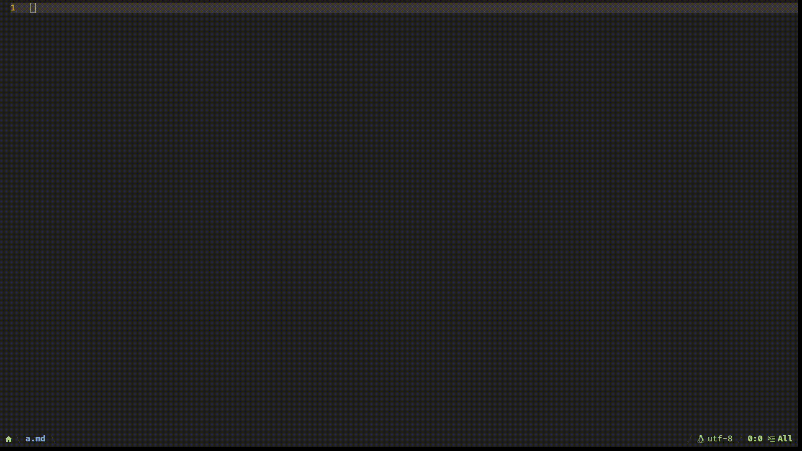

# markdown-table-mode.nvim
format markdown table under cursor when you leave insert mode or input `|`

### Screenshot


### Install
**lazy.nvim**

```lua
{
  'Kicamon/markdown-table-mode.nvim',
  config = function()
    require('markdown-table-mode').setup()
  end
}
```

**vim-plug**

```vim script
Plug 'Kicamon/markdown-table-mode.nvim'
lua require('markdown-table-mode').setup()
```


### Configuration
defualt config
```lua
require('markdown-table-mode').setup({
  filetype = {
    '*.md',
  },
  options = {
    insert = true, -- when typeing "|"
    insert_leave = true, -- when leaveing insert
    pad_separator_line = false, -- add space in separator line
  },
})
```
